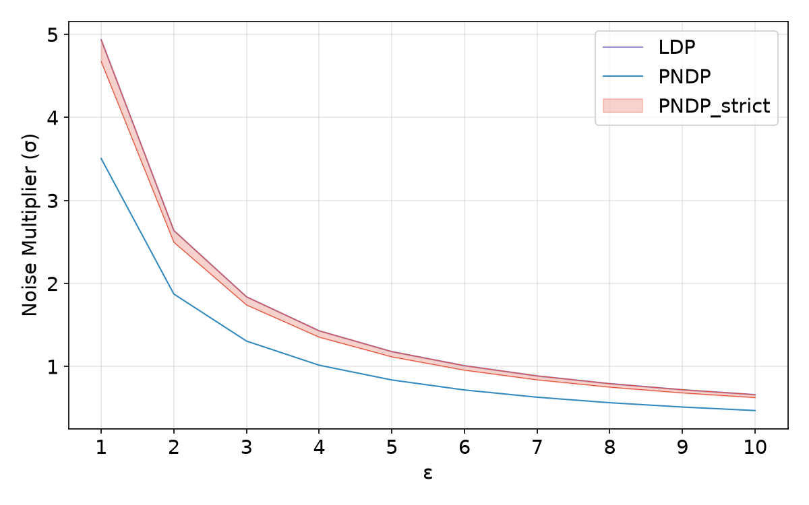
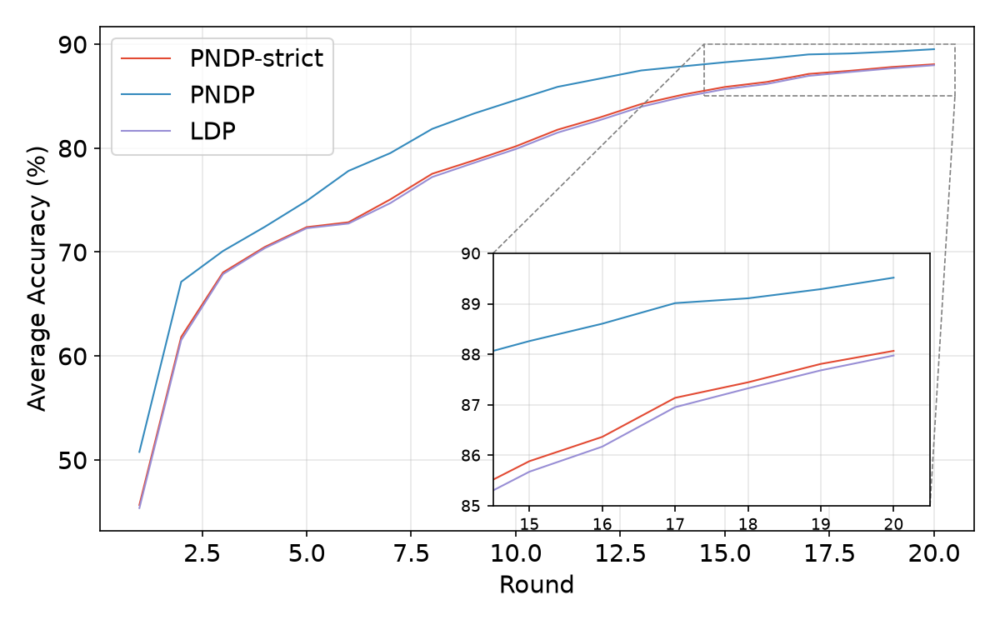

<div align="right">

[中文](README.md)

</div>

# PNDP Calculator: A Privacy Noise Multiplier Calculator for Decentralized Learning

This project provides a differential privacy (DP) noise multiplier calculator for decentralized learning (DL), together with a decentralized training example based on MNIST.

The current implementation supports three privacy analysis modes:

- **LDP**: Local Differential Privacy, based on a conservative assumption that all communications are publicly observable.
- **PNDP**: Pairwise Network Differential Privacy, which computes a global noise multiplier based on the average effective variance associated with each adversarial node.
- **PNDP_strict**: Strict PNDP analysis, which selects the worst-case adversarial node for each victim node and returns node-specific noise multipliers.

The privacy accounting module supports:

- **RDP**: Rényi Differential Privacy.
- **GDP**: Gaussian Differential Privacy.

The theoretical background of this project follows research that uses Matrix Factorization (MF) to provide a unified representation of decentralized learning algorithms, adversarial observations, and noise correlations. The current implementation mainly computes effective variance based on the network topology, projections onto adversarial observation spaces, and Semidefinite Programming (SDP).

> This repository is a research-oriented implementation. Before using it in formal experiments or practical applications, verify that the training process, sampling strategy, communication matrix, and privacy accounting assumptions exactly match your setting.

---

## Features

1. Compute the `noise_multiplier` from a target privacy budget $(\varepsilon, \delta)$.
2. Support both RDP and GDP privacy accounting frameworks.
3. Support standard LDP, global PNDP, and node-wise PNDP_strict analysis.
4. Automatically construct a random-walk matrix from a `networkx.Graph`.
5. Construct adversarial observation matrices and compute their row-space projection matrices.
6. Use SDP to solve for the effective variance of different attacker–victim pairs.
7. Provide a decentralized training example using MNIST, a Convolutional Neural Network (CNN), and Opacus.
8. Export experiment parameters and per-round accuracy results for subsequent visualization and comparison.

---

## Project Structure

```text
.
├── pndp_calculator/
│   ├── __init__.py
│   ├── api.py
│   ├── core_accountant.py
│   └── topology_analyzer.py
├── example.py
├── train_example_mnist.py
├── noise_multiplier.png
├── average_acc.png
├── README.md
└── README_EN.md
```

The files serve the following purposes:

- `api.py`: Provides the unified `PNDPAccountant` interface.
- `core_accountant.py`: Implements the basic accounting functions for RDP, GDP, and partially sampled RDP.
- `topology_analyzer.py`: Constructs communication matrices, adversarial observation matrices, and projection matrices, and computes effective variance through SDP.
- `example.py`: Demonstrates noise multiplier computation for LDP, PNDP, and PNDP_strict.
- `train_example_mnist.py`: Performs decentralized training using MNIST, PyTorch, and Opacus.

---

## Installation

Install the basic privacy accounting dependencies:

```bash
cd pndp_calculator
pip install -r requirements_pndp.txt
```

To run the MNIST training example, also install:

```bash
pip install -r requirements.txt
```

---

## Quick Start

### 1. Run the Noise Multiplier Example

```bash
python example.py
```

The example first computes LDP without requiring a graph structure. It then computes PNDP and PNDP_strict on the `florentine_families_graph`.

```python
import networkx as nx
from pndp_calculator import PNDPAccountant

acc = PNDPAccountant(
    N_samples=4490,
    batch_size=16,
    T_local_steps=10,
    R_rounds=50,
    K_gossip=1,
)

# LDP does not require a graph
noise_multiplier, best_alpha = acc.get_noise_multiplier(
    target_epsilon=8.0,
    target_delta=1e-5,
    algorithm="LDP",
    framework="RDP",
)

# PNDP and PNDP_strict require a communication graph
G = nx.florentine_families_graph()
acc.set_graph(G)

noise_multiplier, mu = acc.get_noise_multiplier(
    target_epsilon=8.0,
    target_delta=1e-5,
    algorithm="PNDP",
    framework="GDP",
)

node_noise_multipliers = acc.get_noise_multiplier(
    target_epsilon=8.0,
    target_delta=1e-5,
    algorithm="PNDP_strict",
    framework="RDP",
)
```

### 2. Run Decentralized MNIST Training

Enable PNDP with GDP accounting:

```bash
ENABLE_PRIVACY=true \
ALGORITHM=PNDP \
FRAMEWORK=GDP \
EPSILON=8.0 \
DELTA=1e-5 \
python train_example_mnist.py
```

Enable node-specific noise multipliers:

```bash
ENABLE_PRIVACY=true \
ALGORITHM=PNDP_strict \
FRAMEWORK=RDP \
python train_example_mnist.py
```

Specify a noise multiplier directly and skip automatic computation:

```bash
ENABLE_PRIVACY=true \
SET_NM=1.2 \
python train_example_mnist.py
```

---

## `PNDPAccountant` Parameters

```python
PNDPAccountant(
    N_samples,
    batch_size,
    T_local_steps,
    R_rounds,
    K_gossip=1,
)
```

| Parameter | Description |
| --- | --- |
| `N_samples` | Number of local samples held by each node, not the total number of samples across all nodes |
| `batch_size` | Logical batch size |
| `T_local_steps` | Number of local update steps per round |
| `R_rounds` | Total number of communication rounds |
| `K_gossip` | Number of Gossip communication or aggregation operations per round |

---

## Supported Algorithms and Return Values

| `algorithm` | Graph Required | Return Value | Meaning in the Current Implementation |
| --- | ---: | --- | --- |
| `LDP` | No | `(noise_multiplier, metric)` | Uses the standard LDP effective variance |
| `PNDP` | Yes | `(noise_multiplier, metric)` | Computes the average effective variance over other nodes for each attacker and then selects the worst-case attacker |
| `PNDP_strict` | Yes | `{node_name: noise_multiplier}` | Selects the worst-case attacker for each victim node and returns node-specific results |

The meaning of `metric` depends on `framework`:

- When `framework="RDP"`, the returned metric is the optimal Rényi order `alpha` found during the search.
- When `framework="GDP"`, the returned metric is the corresponding GDP parameter `mu`.

---

## Methodology Overview

This implementation is based on the unified privacy analysis framework introduced in the paper *Unified Privacy Guarantees for Decentralized Learning via Matrix Factorization*. It focuses on **noise calibration for DP-D-SGD with independent noise under the LDP and PNDP trust models**.

It is important to emphasize that the current project implements the paper's **privacy accounting ideas and their application to independent-noise DP-D-SGD**. It is not a complete reproduction of the MAFALDA-SGD algorithm proposed in the paper.

### 1. Unified Analysis Framework in the Paper

The paper stacks all data-dependent gradients generated during training into a matrix $G$ and all injected Gaussian noise into a matrix $Z$. The information available to an attacker is represented uniformly as:

$$
O_{\mathcal A}=AG+BZ.
$$

Here:

- $A$ describes how gradients enter the attacker's view through local updates, network propagation, and message observations.
- $B$ describes how noise enters the attacker's view.
- $O_{\mathcal A}$ represents the information observable by the attacker throughout the training process.

When a matrix $C$ exists such that $A=BC$, privacy can be analyzed using a Matrix Factorization mechanism. The generalized sensitivity defined in the paper is:

$$
\operatorname{sens}_{\Pi}(C;B)=\max_{G\simeq_{\Pi}G'}\left\|C(G-G')\right\|_{B^\dagger B},
$$

where $B^\dagger B$ is the orthogonal projection onto the row space of $B$. This projection removes gradient directions that the attacker cannot recover from the observed messages. As a result, it can often produce a smaller privacy loss than the LDP analysis, which assumes that all messages are publicly observable.

The participation pattern $\Pi$ describes the training steps at which the same sample may appear.

Under different trust models, the attacker has access to different observations:

| Trust Model | Attacker Capabilities in the Paper |
| --- | --- |
| LDP | Assumes that all communication messages in the network can be observed by the attacker |
| PNDP | The attacker is a node in the network that only observes messages it sends or receives and knows its own gradients and noise |
| SecLDP | In addition to communication messages, conditional privacy guarantees are constructed using secret noise known to the attacker |

The current implementation only supports the first two trust models and does not implement SecLDP.

### 2. DP-D-SGD in the Paper and the Current Implementation

For DP-D-SGD with independent Gaussian noise, the paper sets the noise correlation matrix to:

$$
C=I.
$$

Under the PNDP model, an attacker $a$ can only observe local messages associated with itself. Let the corresponding observation matrix be $B_a$. The privacy sensitivity then depends on:

$$
P_a=B_a^\dagger B_a.
$$

The key quantity used in the paper's PNDP experiments for DP-D-SGD is the projection onto the row space of the attacker's observation matrix:

$$
\mathrm{sens}_{\Pi}(C;B)
=
\max_{G\simeq_{\Pi}G'}
\left\|C(G-G')\right\|_{B^\dagger B}.
$$

The current implementation follows this central idea. However, instead of directly using an element-wise absolute-sum bound as the final result, it solves a semidefinite program for every attacker, victim node, and cyclic participation position to compute the corresponding effective variance multiplier.

### 3. Privacy Accounting Workflow in the Current Implementation

The implementation first constructs a Metropolis–Hastings-style Gossip matrix $W$ from the network topology:

$$
W_{ij}=
\frac{1}{\max(d_i,d_j)},\qquad (i,j)\in E,
$$

with diagonal entries:

$$
W_{ii}=1-\sum_{j\ne i}W_{ij}.
$$

It then computes $I,W,W^2,\ldots$ to describe how an update generated by one node affects messages observable by other nodes after multiple rounds of neighbor averaging.

For every attacker node $a$, the implementation performs the following steps:

1. Treat the attacker itself and its direct neighbors as observable nodes.
2. Construct the attacker's message observation matrix $B_a$ using powers of $W$.
3. Set the gradient columns corresponding to the attacker itself to zero, because the attacker's own gradients are not unknown information that needs to be protected from that attacker.
4. Compute the row-space projection using Singular Value Decomposition (SVD):

$$
P_a=B_a^\dagger B_a.
$$

5. Extract a submatrix $H$ from the gradient columns corresponding to different temporal appearances of the same sample at the victim node, according to the cyclic participation pattern.
6. Solve the following semidefinite program:

$$
\begin{aligned}
\max_X\quad & \mathrm{tr}(HX),\\
\text{s.t.}\quad & X\succeq 0,\\
& \mathrm{diag}(X)\leq 1.
\end{aligned}
$$

The optimal value of this problem is used as the effective variance multiplier for attacker $a$ and victim node $u$, denoted by:

$$
M_{a,u}.
$$

The resulting attacker–victim matrix is:

$$
M=
\begin{bmatrix}
M_{1,1} & \cdots & M_{1,n}\\
\vdots & \ddots & \vdots\\
M_{n,1} & \cdots & M_{n,n}
\end{bmatrix}.
$$

This procedure follows the paper's central idea that privacy loss is determined by the row space of the attacker's observation matrix. However, the SDP formulation and the subsequent aggregation strategy are specific to the current implementation.

### 4. Relationship to the Cyclic Participation Pattern

The paper uses a participation pattern $\Pi$ to describe the gradient steps at which the same sample may appear. The current implementation approximates local data access using a fixed-interval cyclic participation pattern and defines:

$$
b=\left\lceil\frac{N_{\text{samples}}}{\text{batch size}}\right\rceil,
$$

where $b$ is the approximate number of steps between two successive appearances of the same sample.

The total number of local update steps is:

$$
S=R_{\text{rounds}}T_{\text{local}},
$$

and the maximum number of times the same sample may participate is:

$$
k=\left\lceil\frac{S}{b}\right\rceil.
$$

The participation positions checked by the implementation are therefore approximated as:

$$
\pi(s)=\{s,s+b,s+2b,\ldots,s+(k-1)b\}.
$$

This corresponds to the $(k,b)$ cyclic participation pattern used in the paper. However, the current training script does not explicitly enforce that samples appear according to this exact fixed cycle. Therefore, it is a modeling assumption adopted by the accountant rather than a sampling sequence directly guaranteed by the training code.

### 5. Meaning of the Three Accounting Modes

#### LDP

LDP assumes that the attacker can observe all communication information and therefore does not exploit privacy amplification from local network visibility.

The current implementation does not explicitly construct a complete global message matrix. Instead, it computes the effective variance based on the number of times the same sample appears within each round:

$$
v_{\mathrm{LDP}}=\max_{\text{offset}}\sum_{r=1}^{R}\frac{z_r^2}{T},
$$

where $z_r$ is the number of appearances of the sample during local updates in round $r$ for a particular participation offset.

#### PNDP_strict

For every protected node $u$, the implementation selects the worst-case attacker among all other nodes:

$$
v_u=\max_{a\ne u}M_{a,u}.
$$

It then calibrates a separate noise multiplier for each node:

$$
\sigma_u=\sigma_{\text{base}}\sqrt{v_u}.
$$

Therefore, `PNDP_strict` returns an independent noise multiplier for every node. It corresponds to a stricter victim-centered analysis in which every node is protected against its own worst-case attacker and fully satisfies the DP guarantee under the adopted accounting assumptions.

#### PNDP

For each attacker, the implementation first computes the average effective variance over all other nodes:

$$
\bar v_a=
\frac{1}{n-1}\sum_{u\ne a}M_{a,u}.
$$

It then selects:

$$
v_{\mathrm{PNDP}}=\max_a\bar v_a.
$$

All nodes use the same noise multiplier:

$$
\sigma_{\mathrm{PNDP}}=\sigma_{\text{base}}\sqrt{v_{\mathrm{PNDP}}}.
$$

This mode is inspired by *Muffliato: Peer-to-Peer Privacy Amplification for Decentralized Optimization and Averaging*. It makes it convenient to train all nodes using a unified noise multiplier.

However, it is an implementation-specific aggregation rule based on the average risk of the worst attacker. It implicitly assumes that closer neighbors are more trustworthy and does not fully satisfy the standard DP guarantee.

### 6. From Effective Variance to the Noise Multiplier

After obtaining an effective variance multiplier $v$, the implementation first solves for a base noise multiplier $\sigma_{\text{base}}$ that satisfies the target $(\varepsilon,\delta)$ privacy budget under unit effective variance. It then applies the following scaling:

$$
\sigma_{\text{final}}=\sigma_{\text{base}}\sqrt{v}.
$$

The current implementation supports two accounting frameworks:

- **RDP**, or Rényi Differential Privacy: iterates over multiple Rényi orders $\alpha$ and selects the order that produces the smallest $\varepsilon$.
- **GDP**, or Gaussian Differential Privacy: first solves for the GDP parameter $\mu$ that satisfies the target $(\varepsilon,\delta)$ and then computes the noise multiplier using $\mu=1/\sigma$.

The paper mainly develops its unified theory using GDP and notes that GDP can be converted into RDP or $(\varepsilon,\delta)$-DP. The current implementation instead provides direct numerical inversion interfaces for both RDP and GDP.

---

## MNIST Training Configuration

`train_example_mnist.py` reads its main configuration from environment variables.

| Environment Variable | Default Value | Description |
| --- | ---: | --- |
| `DATASET` | `MNIST` | The current implementation only supports MNIST |
| `GRAPH` | `florentine_families` | Name of the graph used by the current implementation |
| `BATCH_SIZE` | `256` | Logical batch size |
| `MAX_PHYSICAL_BATCH_SIZE` | `256` | Maximum physical batch size used by Opacus |
| `T_LOCAL_STEPS` | `20` | Number of local update steps per round |
| `R_ROUNDS` | `20` | Number of training rounds |
| `K_GOSSIP` | `1` | Number of Gossip operations per round used by the accountant |
| `EPSILON` | `3.0` | Target privacy budget $\varepsilon$ |
| `DELTA` | `1e-5` | Target privacy budget $\delta$ |
| `CLIP_NORM` | `1` | Gradient clipping threshold |
| `LR` | `1e-3` | Learning rate |
| `GPU` | `0` | GPU selected through `CUDA_VISIBLE_DEVICES` |
| `FRAMEWORK` | `GDP` | `RDP` or `GDP` |
| `ALGORITHM` | `PNDP` | `LDP`, `PNDP`, or `PNDP_strict` |
| `ENABLE_PRIVACY` | `True` | Whether to enable private training through Opacus |
| `SET_NM` | `None` | Whether to manually specify a unified noise multiplier |
| `CACHE_NOISE` | `True` | Whether to load a previously computed noise multiplier from cache |
| `OUT_DIR` | Automatically generated | Experiment output directory |

---

## Experiment Outputs

The default output directory is:

```text
exps/<timestamp>_<dataset>_<graph>_<parameter_combination>/
```

The main output files include:

- `params.json`: Stores experiment parameters and either the unified noise multiplier or the node-specific noise multipliers.
- `accuracy.csv`: Stores the mean accuracy, maximum accuracy, minimum accuracy, consensus gap, and average loss for every round.

The columns in `accuracy.csv` are:

```text
round,mean_acc,max_acc,min_acc,consensus_gap,avg_loss
```

---

## Example Results

### Noise Multipliers under Different Privacy Budgets



Under the configuration shown in the figure, the noise multiplier required to satisfy the target privacy budget generally decreases as $\varepsilon$ increases.

PNDP exploits privacy amplification from local adversarial observations and network mixing. Therefore, it requires less noise than the more conservative LDP analysis.

PNDP_strict calibrates each node against its worst-case attacker and is therefore usually more conservative than the averaged PNDP mode.

### Average Accuracy of Different Methods



In the experiment shown in the figure, the average accuracy of all three methods increases over the course of training.

PNDP uses a lower noise multiplier and therefore achieves higher accuracy. The curves for PNDP_strict and LDP are relatively close. The inset in the lower-right corner enlarges the differences during the later stages of training.

> These conclusions only apply to the experimental configuration shown in the current figures. They should not be directly generalized to other graph structures, models, data partitions, or privacy budgets.

---

## References

> Aurelien Bellet, Edwige Cyffers, Davide Frey, Romaric Gaudel, Dimitri Lereverend, François Taïani.  
> *Unified Privacy Guarantees for Decentralized Learning via Matrix Factorization*. ICLR 2026.  
> arXiv:2510.17480.

> Edwige Cyffers, Mathieu Even, Aurélien Bellet, Laurent Massoulié.  
> *Muffliato: Peer-to-Peer Privacy Amplification for Decentralized Optimization and Averaging*. NeurIPS 2022.  
> arXiv:2206.05091.

---

## Future Work

- [ ] Add support for more graph structures and datasets.
- [ ] Save and visualize the complete attacker–victim effective variance matrix `M`.
- [ ] Add caching for SDP results to avoid repeated computation.
- [ ] Integrate improved privacy amplification methods for sampling, such as Bnb.
